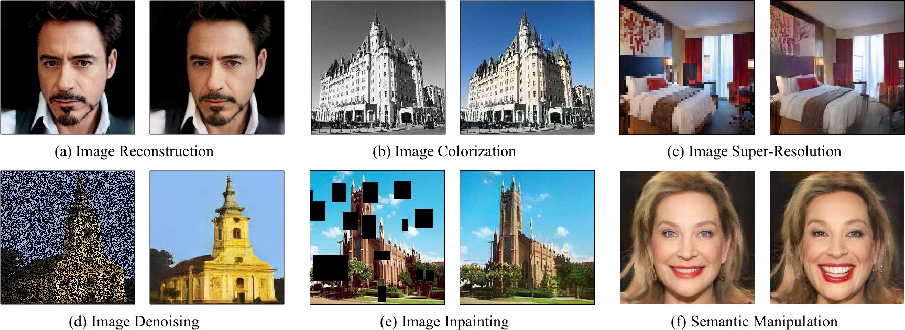

# Image Processing Using Multi-Code GAN Prior



**Figure:**  Multi-code GAN prior facilitates many image processing applications using the reconstruction from fixed GAN models.

In this work, we propose a new inversion approach to applying well-trained GANs as effective prior to a variety of image processing tasks, such as image colorization, super-resolution, image inpainting, and semantic manipulation.

> **Image Processing Using Multi-Code GAN Prior**<br>
> Jinjin Gu, Yujun Shen, Bolei Zhou <br>
> *Computer Vision and Pattern Recognition (CVPR), 2020*

[[Paper](https://arxiv.org/pdf/1912.07116.pdf)]
[[Project Page](https://genforce.github.io/mganprior/)]

## How To Use

### Install dependencies

Install dependencies using the following code before performing Multi-Code GAN Inversion.

```bash
python -m pip install -r requirements.txt
```

### Download the Pre-train GAN Models

In this work, we use the well-trained GAN models as prior, including [PGGAN](https://github.com/tkarras/progressive_growing_of_gans) and [StyleGAN](https://github.com/NVlabs/stylegan). Pytorch version models are borrowed from [HiGAN](https://github.com/genforce/higan). See [here](./models/README.md) for more details.

As both PGGAN and StyleGAN use aligned face for GAN training, all faces used in this repo are pre-aligned. The alignment method can be found at [stylegan-encoder](https://github.com/Puzer/stylegan-encoder).

### Invert Images with Multi-Code GAN Inversion

With a given GAN model and a target image, you can invert the image to multiple latent codes by running

```bash
python multi_code_inversion.py
       --gan_model pggan_bedroom
       --target_images ./examples/gan_inversion/bedroom
       --outputs ./gan_inversion_bedroom
       --composing_layer 8
       --z_number 20
```

### Colorization

For image colorization task, run

```base
python colorization.py
       --gan_model pggan_bedroom
       --target_images ./examples/colorization/bedroom
       --outputs ./colorization
       --composing_layer 6
       --z_number 20
```

### Inpainting

For image inpainting task (inpainting mask should be known in advance), run

```bash
python inpainting.py
       --gan_model pggan_churchoutdoor
       --target_images ./examples/inpainting/church
       --outputs ./inpainting
       --mask ./examples/masks/mask-1.png
       --composing_layer 4
       --z_number 30
```

### Super-Resolution

For image super-resolution task (SR factor should be known in advance), run

```bash
python super_resolution.py
       --gan_model pggan_celebahq
       --target_images ./examples/superresolution
       --outputs ./SR_face
       --factor 16
       --composing_layer 6
       --z_number 20
```

### Semantic Face Editing

We achieve semantic face editing together with [InterfaceGAN](https://genforce.github.io/interfacegan/). Please refer to [this repo](https://github.com/genforce/interfacegan) to see how to train semantic boundaries in the latent space as well as how to achieve face manipulation by varying the latent code.

In this project, you can simply run

```bash
python face_semantic_editing.py
       --gan_model pggan_celebahq
       --target_images ./examples/face
       --outputs ./face_manipulation
       --attribute_name gender
       --composing_layer 6
       --z_number 30
```
